<!-- slide 1 -->

  <h1 style="font-size: 3.5em; border: none; text-shadow: 0 0 20px rgba(255,18,104,0.6);">Omni 万象抢票平台</h1>
  <h2 style="color: #e0e0e0; font-weight: 300; margin-top: 20px;">基于 Spring Cloud Alibaba 与 Next.js 的微服务票务系统设计与实现</h2>
    
  
负责人：本组成员全体

  
答辩日期：2026 年

---

<!-- slide 2 -->

# 团队分工

项目由 6 人合作完成，分为三条研发主线：

| 小组 | 成员 | 负责方向 | 技术栈关键词 |
|---|---|---|---|
| **第 1 组** | 成员 A、B | 业务需求、数据与缓存设计 | 需求分析、PostgreSQL、Redis |
| **第 2 组** | 成员 C、D | 后端架构、微服务治理与核心链路 | Spring Cloud, Nacos, Sentinel, Seata |
| **第 3 组** | 成员 余凯欣、李彦杞 | 前端展示、系统验证与系统演示 | Next.js, Elasticsearch, RabbitMQ |

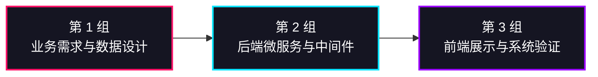

---

<!-- slide 3 -->

# 项目背景

在热门演唱会和赛事的抢票场景中，传统单体架构面临巨大挑战：

| 业务痛点 | 详细说明 |
|---|---|
| **热门票务需求集中** | 演唱会、赛事、展览等活动购票高峰明显 |
| **系统并发压力大** | 热门活动开票时，系统产生大量集中并发访问 |
| **支付链路复杂** | 购票涉及到锁定座位、生成订单、对接第三方支付平台 |
| **管理角色复杂** | 平台管理员、主办方、普通用户职责与权限隔离困难 |

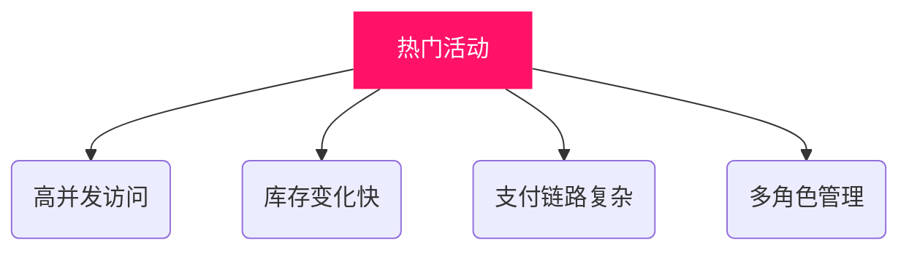

---

<!-- slide 4 -->
# 项目目标

打造一个高可用、可伸缩的现代化 B2B2C 票务平台：

- **用户购票 (C端)**
  - 浏览活动、查看详情、选择票档、创建订单、支付
- **主办方管理 (B端)**
  - 发布活动、管理场次、管理票档、查看销售情况
- **平台后台管理 (Admin)**
  - 用户管理、活动审核、系统维护
- **前沿技术实践**
  - 微服务拆分、服务治理、缓存、异步消息、搜索优化

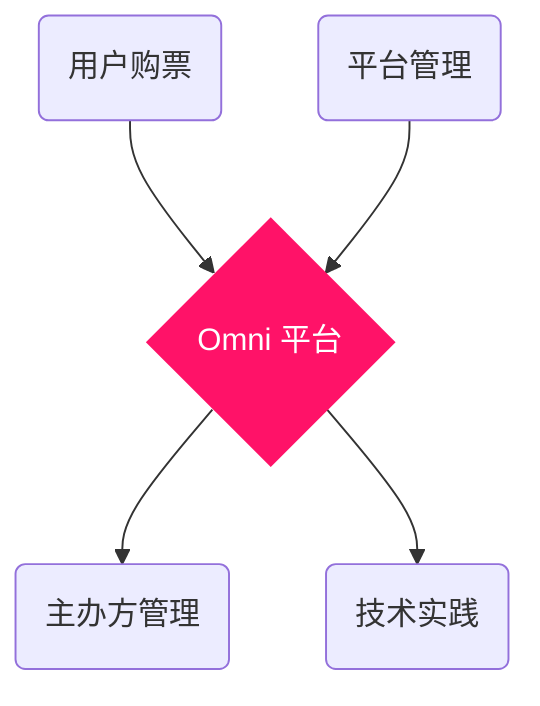

---

<!-- slide 5 -->
# 需求分析与系统角色

针对不同业务角色，系统提供全方位的闭环支持：

| 角色类型 | 核心功能需求 |
|---|---|
| 👤 **普通用户** | 注册登录、浏览活动、关键词搜索、下单购票、支付、查看订单 |
| 🏢 **活动主办方** | 发布活动、排期与场次管理、多级票档管理、销售数据查看 |
| 🛡️ **平台管理员** | 用户管理、活动管理与审核、主办方资质管理、平台全局维护 |

```mermaid
graph LR
  User[普通用户] --> Func1(浏览活动 / 下单 / 支付 / 查订单)
  Org[主办方] --> Func2(发布活动 / 管理场次 / 管理票档)
  Admin[管理员] --> Func3(用户管理 / 活动管理 / 平台维护)
  
  style User fill:#151522,stroke:#00e5ff
  style Org fill:#151522,stroke:#ff1268
  style Admin fill:#151522,stroke:#9d00ff
```

---

<!-- slide 6 -->
# 核心业务流程

用户购票链路是整个平台最核心、也是并发量最大的流转链路。

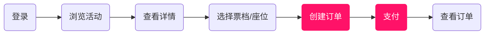

- **待支付（STATUS_PENDING）**：订单创建后，座位与库存资源临时锁定。
- **已支付（STATUS_PAID）**：支付同步回调成功后，订单状态流转，座位正式售出。

---

<!-- slide 7 -->
# 系统总体架构

基于 `前后端分离` 和 `微服务集群` 模式。

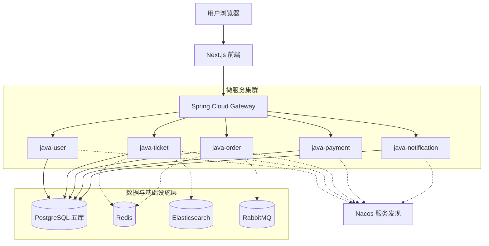

---

<!-- slide 8 -->
# 微服务模块划分

平台拆分为 **5 个核心业务服务** 与 **1 个网关服务**：

| 微服务名 | 运行端口 | 核心职责边界 |
|---|---|---|
| **java-gateway** | `:8088` | 全局统一入口、路由转发 |
| **java-user** | `:8081` | 用户、登录、角色权限管理 |
| **java-ticket** | `:8082` | 活动、场次、票档、库存与座位管理 |
| **java-order** | `:8083` | 订单创建、订单快照保存、订单状态维护 |
| **java-payment** | `:8084` | 支付二维码生成、支付宝沙盒同步、退款校验 |
| **java-notification**| `:8085` | 通知消息、订单变更触达 |

---

<!-- slide 9 -->
# 微服务治理与服务调用

基于 **Spring Cloud Alibaba** 体系构建健壮的服务治理能力。

| 核心组件 | 平台应用场景 |
|---|---|
| **Spring Cloud** | 微服务基础框架，支撑核心模块的低耦合拆分 |
| **Nacos** | 服务注册与发现，Gateway 根据服务名实现动态路由转发 |
| **OpenFeign** | 服务间声明式 HTTP 调用（如 order 调用 user 校验、调用 ticket 锁座） |
| **Sentinel** | 接口限流、熔断与降级，有效保护抢票、下单、支付等高并发路由 |

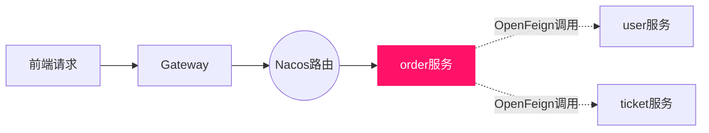

---

<!-- slide 10 -->
# 高并发与数据一致性设计

### 高并发应对
- **Redis 缓存层**：缓存活动信息、票档库存、抢票锁及防重复提交。
- **异步削峰 (MQ)**：异步订单变更通知、支付结果通知与邮件发送，实现业务解耦。

### 数据一致性保障
- **Sentinel 保护**：拦截突发流量峰值，保障系统可用性。
- **分布式事务 (Seata)**：跨服务事务一致性设计，确保订单、库存、支付间的数据强一致问题。

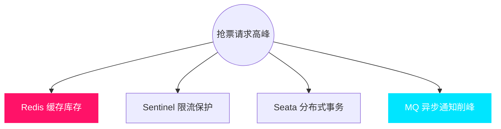

---

<!-- slide 11 -->
# 数据库设计：生产级五库拆分

为突破单库瓶颈，项目严格实施**基于微服务的物理拆库**：

| 微服务名 | 对应的独立数据库 |
|---|---|
| **java-user** | `omni_user` |
| **java-ticket** | `omni_ticket_split` |
| **java-order** | `omni_order` |
| **java-payment** | `omni_payment` |
| **java-notification**| `omni_notification` |

> **开发纪律要求**：
> 服务独立拥有数据库，**绝对禁止**跨服务直接查表（No JOINs across services）。订单详情通过 `order_snapshot` 保存快照，服务之间依靠 Internal API 协作。

---

<!-- slide 12 -->
# 核心流程：下单与支付

展示跨服务协作的完整生命周期泳道：

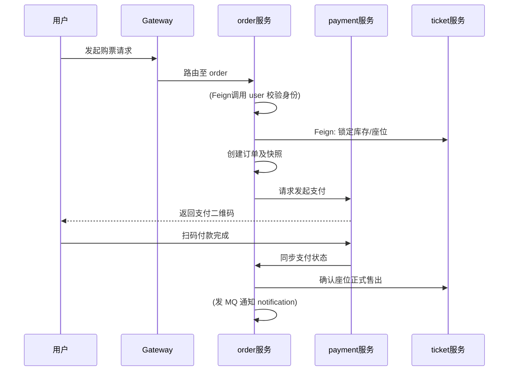

---

<!-- slide 13 -->
# 服务边界控制与内部 API 安全

微服务架构下如何处理复杂关联数据查询？

**❌ 错误方式：打破物理边界**
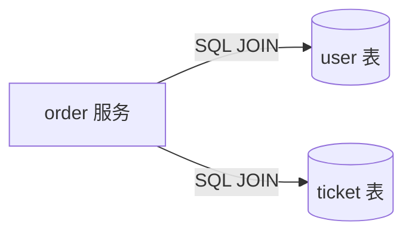

**✅ 正确方式：Internal API 协作 (本平台规范)**
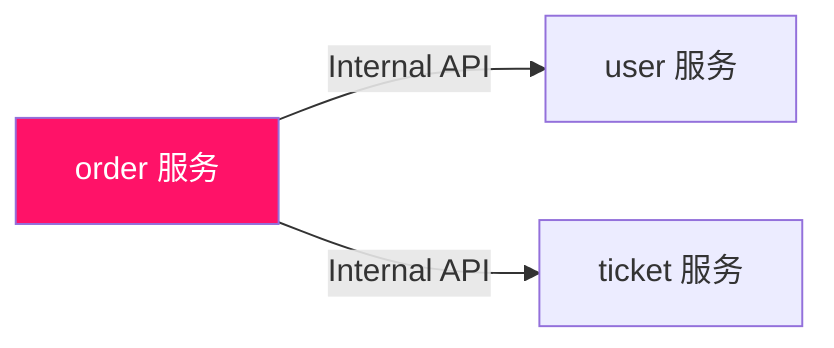

**安全控制**：所有内部新增 Internal API 必须校验 `X-Internal-Token`。网关层拦截外部针对 Internal 路径的直接访问，保障数据安全。

---

<!-- slide 14 -->
# 搜索与缓存设计

票务平台面临极高的“读操作”频率，展示严重依赖检索与缓存。

| 技术栈 | 业务作用域 |
|---|---|
| **Redis** | 缓存活动详情、票档库存预热、热点数据读取 |
| **Elasticsearch** | 支持活动标题、地点、分类、主办方等的全文检索过滤 |
| **PostgreSQL** | 持久化保存核心业务结构化数据 |

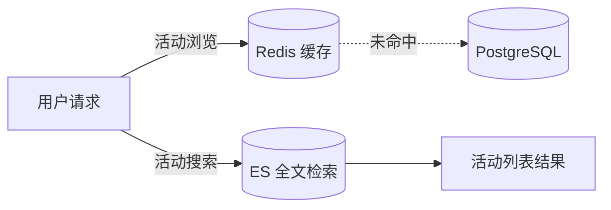

---

<!-- slide 15 -->
# 前端页面设计与工程化

前端采用 **Next.js 16 (App Router) + React 19** 构建。

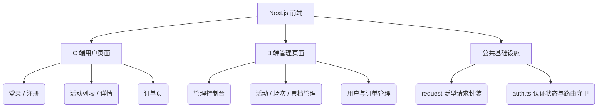

设计规范：使用系统统一品牌色 `#ff1268`，前端页面不允许 Mock 降级，确保真实链路联调。

---

<!-- slide 16 -->
# 用户端 (C端) 功能展示

用户端功能追求顺滑的转化率和清晰的界面视觉展示。

- **安全鉴权登录**：手机号和密码登入。
- **活动瀑布流浏览**：查看各类演唱会、赛事、展览。
- **详情页直观展示**：查看详细场次安排、多级票档、价格与位置分布。
- **沉浸式下单支付**：快速创建订单流转至收银台完成支付动作。
- **订单生命周期跟进**：实时查看订单状态变更。

*(答辩时此处可配合演示真实前端界面截图或进行系统实机演示)*

---

<!-- slide 17 -->
# B端控制台与管理功能展示

采用 `ConsoleLayout` 侧边栏布局，为票务主办方与平台管理员提供高效的生产力后台。

| 角色视角 | 可用管理功能 |
|---|---|
| **主办方 (Organizer)** | 发布活动图文、设置活动排期及场次、管理多级票档价格 |
| **管理员 (Admin)** | 用户权限及状态管理、全站活动及主办方资质管理 |
| **平台运营 (Platform)** | 业务数据维护、全局订单及销售情况大盘查看、运营支持 |

*(答辩时此处可切换至 `13800000002` 账号演示后台操作视图)*

---

<!-- slide 18 -->
# 答辩现场：系统演示流程

我们将按照以下真实业务场景进行系统上机连贯实操：

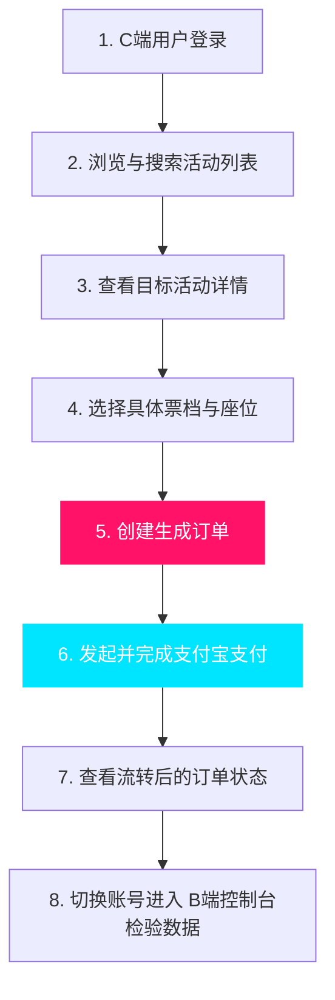

---

<!-- slide 19 -->
# 测试运行结果与系统边界巡检

在答辩之前，全套微服务系统已通过严格的质量与架构约束门禁：

| 测试验证环节 | 覆盖内容与工具 | 结果 |
|---|---|---|
| **功能接口测试** | 登录、发版、下单、支付同步全链路接口 | ✅ Pass |
| **前端类型安全** | Next.js 运行 `pnpm typecheck` | ✅ Pass |
| **微服务边界检查**| 运行专属的 `verify-microservice-boundaries.ps1` | ✅ Pass |
| **服务运行验证** | Gateway、Nacos 及 5 个后端微服务组件注册 | ✅ Pass |
| **底座数据库验证**| 五库物理隔离，监控查验无异常跨库连接流 | ✅ Pass |

系统真实部署于 `prod-split` 分库环境运行，逻辑严谨，架构无水分。

---

<!-- slide 20 -->
# 项目亮点与总结展望

### 💡 核心亮点总结
- **严格微服务拆分**：user/ticket/order/payment/notification 独立闭环。
- **强边界五库隔离**：禁止跨库 JOIN，通过 Internal API 与订单快照解决展示。
- **前后端全流程拉通**：覆盖 C 端消费购票及 B 端生产管理。
- **完善的中间件体系**：聚合 Nacos、Sentinel、Redis、MQ 解决核心高并发痛点。

### 🚀 未来展望
- **打磨抢票引擎策略**：引入异步排队轮询与 WebSocket 通知机制。
- **强化全链路追踪**：引入监控面板跟踪复杂微服务调用链时长。
- **体验与业务升级**：完善退款与补偿重试机制、优化前端渲染交互体验。

 
<h3 style="text-align: center; color: #ff1268; margin-top: 40px;">感谢各位评审老师聆听与指导！</h3>
<h4 style="text-align: center; color: #888;">Q & A</h4>
