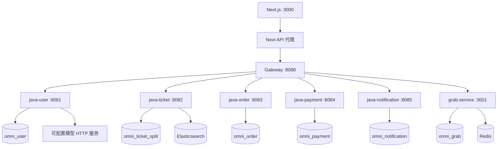
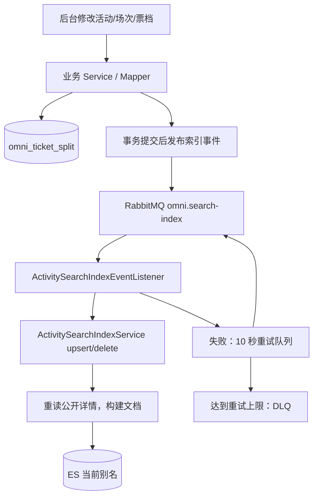
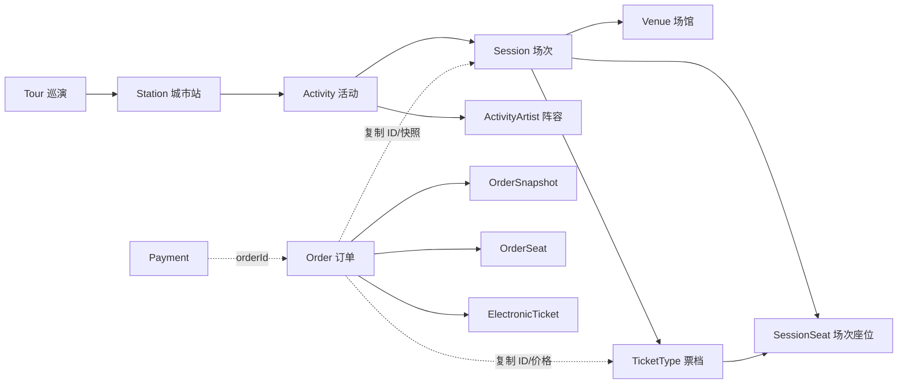
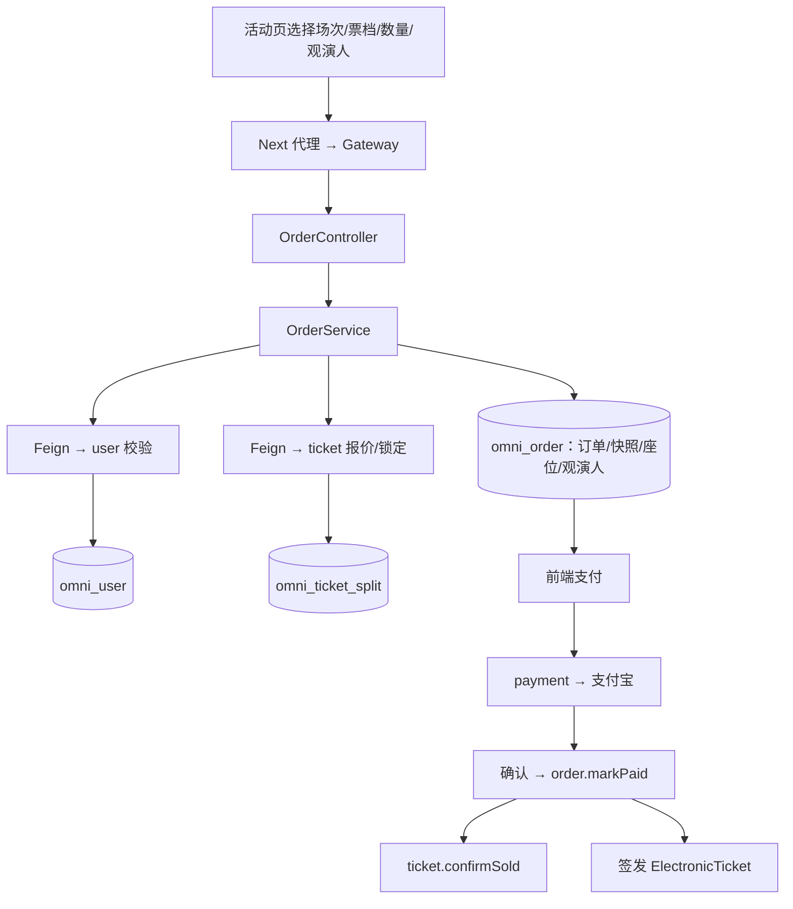
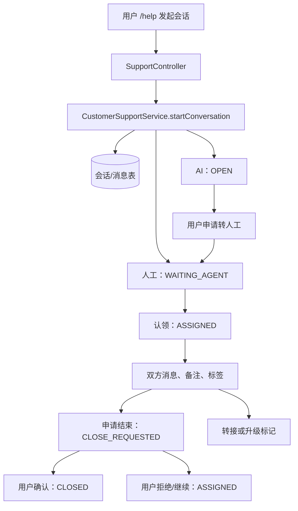
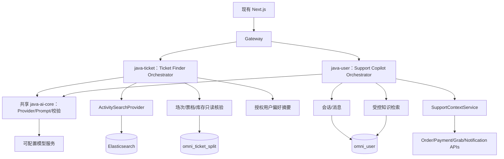

# Omni AI 改造前项目审计报告

> 审计日期：2026-09-14  
> 项目路径：`D:\Project\omni`  
> 文档目标：建立对现有 Omni 的完整系统认知，为后续 AI 智能找票、智能客服 Copilot 提供源码依据。  
> 审计方式：递归扫描前端、Java 微服务、NestJS、配置、SQL、测试，向下追踪核心业务调用链。  
> 验证边界：没有运行构建、测试、数据库查询、模型请求或业务写接口；“已有”指源码存在，不代表本次验证了运行可用性。  
> 保存范围：本报告经用户后续授权保存于根目录，未实施 AI 功能，未修改业务代码、数据库或运行配置。源码链接相对仓库根目录。

## 阅读导航

| 项目认知 | AI 改造分析 |
| --- | --- |
| [1. 总体架构](#1-项目总体架构与目录地图) | [15. 当前 AI 能力](#15-当前-ai-与-llm-能力) |
| [2. 微服务地图](#2-全部后端服务地图) | [16. 找票可复用能力](#16-ai-智能找票可复用能力) |
| [3. 前端](#3-前端架构) | [17. Copilot 可复用能力](#17-智能客服-copilot-可复用能力) |
| [4. 数据库](#4-数据库架构) | [18. 技术缺口](#18-两个-ai-功能的技术缺口) |
| [5. 搜索与 Elasticsearch](#5-elasticsearch-与现有搜索系统) | [19. 推荐 AI 架构](#19-推荐-ai-架构) |
| [6. Redis](#6-redis-架构) | [20. 推荐模块](#20-推荐新增模块) |
| [7. MQ 与基础设施](#7-rabbitmq-与微服务基础设施) | [21. 推荐 API](#21-推荐新增-api) |
| [8. 用户与行为数据](#8-用户系统与行为数据) | [22. 推荐表](#22-推荐新增数据库表) |
| [9. 票务关系](#9-票务系统与数据关系) | [23. 推荐权限](#23-推荐新增权限) |
| [10. 订单](#10-订单系统与购买流程) | [24. 推荐页面](#24-推荐新增前端页面) |
| [11. 支付与通知](#11-支付与通知系统) | [25. 风险与测试边界](#25-实现风险与源码发现) |
| [12. 抢票组队候补](#12-抢票组队与候补系统) | [26. 开发顺序](#26-开发顺序建议) |
| [13. 客服](#13-客服系统完整审计) | |
| [14. RBAC](#14-rbac-权限体系) | |

## 审计结论先读

1. **项目已有真实模型 HTTP 调用和客服 SSE 输出，不是从零接入 AI。**
2. **ES 为活动／巡演级聚合索引，不能直接保证具体场次有两张符合预算的票。**
3. **客服会话、人工工作台和跨服务业务上下文已经存在，但上下文和会话历史尚未输入模型。**
4. **部分说明与源码存在漂移。** 当前认证 key、基础设施启动范围、数据库 manifest 必须以实际源码核对。
5. **接入 AI 前应处理相关搜索一致性、客服授权和交易边界。** 不能把现有接口直接无差别开放为模型工具。

---

## 1. 项目总体架构与目录地图

Omni 是类大麦网票务平台，采用 **B 端主导、C 端参与** 模式。架构为 Next.js 前端、Spring Cloud Java 微服务、NestJS 抢票服务及服务独立数据库。

```text
D:/Project/omni
├─ frontend/
│  ├─ src/app/                 App Router 页面、API/上传代理
│  ├─ src/components/          通用组件、座位图、组队组件
│  ├─ src/lib/                 API、认证、权限、推荐、埋点
│  ├─ src/types/               数据类型
│  ├─ public/                  静态资源
│  └─ scripts/                 前端检查
├─ java/
│  ├─ java-common/             公共库，不独立部署
│  ├─ java-gateway/
│  ├─ java-user/
│  ├─ java-ticket/
│  ├─ java-order/
│  ├─ java-payment/
│  └─ java-notification/
├─ nestjs/grab-service/        普通抢票、组队、候补
├─ sql/
│  ├─ production-split/        按服务 owner 拆分的迁移资产
│  ├─ migrations/shared/       历史共享库迁移
│  ├─ local/                   本地隔离实验 SQL
│  ├─ docker-init/
│  └─ seeds/
├─ scripts/                   启动、导入导出、边界/运行检查
├─ docker/                    Seata、Maven 配置
├─ docs/                      架构、运维、生产就绪、设计
├─ docker-compose.yml
├─ docker-compose.production.example.yml
└─ start-project.ps1
```

依赖缓存、构建产物、日志、运行目录、工具生成图和工作区副本与当前源码分开判断。不能把历史文件或测试旧类名当作现行功能。

来源：[java/pom.xml](java/pom.xml)。Java 11、Spring Boot 2.7.18、Spring Cloud 2021.0.8、Spring Cloud Alibaba 2021.0.5.0、MyBatis-Plus 3.5.3.1、Seata 1.6.1，配合 PostgreSQL、Druid、OpenFeign、Nacos、Sentinel。



## 2. 全部后端服务地图

### 2.1 职责、Controller 和 Service

| 模块 | 职责 | Controller | 主要实现 |
| --- | --- | --- | --- |
| java-gateway | 路由、超时、限流、诊断 | 无业务 Controller | GatewaySentinelConfig、GatewayDiagnosticsFilter |
| java-user | 账号、实名、主办方入驻、RBAC、客服、运营工作台 | UserController、SupportController、CsController、InternalWorkbenchController、InternalOperationAuditController | UserService、UserAttendeeService、RbacService、CustomerSupportService、SupportContextService、CsSessionService |
| java-ticket | 活动、巡演、场次、场馆、票档、座位、搜索、评价、订阅 | 下表 11 个 Controller | ActivityService、TourStationService、SessionAdminService、TicketSalesInternalService、搜索与布局服务 |
| java-order | 建单、快照、资源协调、票夹、转赠、核验 | OrderController | OrderService、TicketWalletService、TicketCheckInService、SeatLockScheduler |
| java-payment | 支付宝支付、确认、退款、对账数据源 | PaymentController、AlipayController、RefundController、InternalReconciliationController | AlipayService、PaymentConfirmationService、RefundService、PaymentReconciliationService |
| java-notification | 通知、投递记录、已读/删除、MQ 消费 | NotificationController | NotificationService、NotificationEventService |
| grab-service | 普通抢票、降档、组队、候补和恢复 | GrabController、GrabOpsController、TeamGrabController、WaitlistController | GrabService、GrabWorkerService、TeamGrabProcessorService、WaitlistAllocatorService |
| java-common | 响应、异常、JWT、MQ、审计 DTO | 不独立部署 | Result、JwtUtil、MqPublishSupport、TraceIdFilter |

源码：[user/controller](java/java-user/src/main/java/com/omni/user/controller)、[ticket/controller](java/java-ticket/src/main/java/com/omni/ticket/controller)、[OrderController](java/java-order/src/main/java/com/omni/order/controller/OrderController.java)、[payment/controller](java/java-payment/src/main/java/com/omni/payment/controller)、[NotificationController](java/java-notification/src/main/java/com/omni/notification/controller/NotificationController.java)。

java-ticket 的全部 Controller：

| Controller | 业务 |
| --- | --- |
| ActivityController | 活动列表/详情、评价举报、问答、巡演详情、分类 |
| SearchController | 搜索历史、热搜 |
| SeatController | 场次票档座位图 |
| ReservationController | 场次预约 |
| SubscriptionController | 想看、关注、提醒订阅 |
| TicketSalesInternalController | 报价、库存、普通/组队锁座、售出、释放、退款 |
| TicketRefundReviewInternalController | 退款审核权限 |
| ActivitySearchIndexController | 索引重建 |
| OrganizerOnsaleSummaryController | 主办方开售汇总 |
| ActivityEngagementAdminController | 评价、问答、举报管理 |
| AdminController | 活动/巡演/站点/场次/票档/艺人/场馆、SeatCraft、风险、营销、核验 |

AdminController 还覆盖私有材料、艺人审核、站点配置审批、布局发布/回滚、场馆申请审核，不能只理解成活动 CRUD。

票务重要服务还包括 ActivityDraftService、ActivityAdminService、ActivityMarketingService、ActivityRiskResponseService、ActivityArtistService、ArtistGovernanceService、StationConfigVersionService、SessionSeatService、SessionSeatProtectionService、SessionBlockTicketStockService、SeatCraft 布局/版本服务、VenueApplicationService、PrivateAssetService、ActivityEngagementService、PerformanceSubscriptionService、UserAccessService。

### 2.2 API 地图

| 服务 | 对外 API 面 | 内部 API 面 |
| --- | --- | --- |
| user | `/api/user/login`、注册/资料/观演人/浏览历史；`/help/faqs`、`/support/**`、`/cs/**`；后台 RBAC/运营/审计 | `/api/user/internal/{id}`、`/internal/auth/context/{id}`、`/internal/attendees/resolve`、`/internal/operation-audits` |
| ticket | `/api/ticket/activities`、详情/评价/问答、`/tours/{id}`、`/categories`、座位/预约/订阅、`/admin/**`；`/api/v1/search/**` | `/api/ticket/internal/sales/**`、`/internal/refund-review/permission` |
| order | `/api/order/create`、`/create-with-seats`、`/my`、`/{id}`、退款选项、票夹/转赠/入场码 | `/internal/create*`、`/internal/team/create-with-locked-seats`、订单/票夹查询、支付/退款更新、核验 |
| payment | `/api/payment/alipay/page-pay`、`/qr-pay`、`/notify`、`/sync/{orderId}`、`/record/{orderId}`、`/refunds/**` | `/alipay/internal/sync-order/{orderId}`、`/refunds/internal/direct`、用户退款上下文、`/internal/reconciliation/local` |
| notification | `/api/notification/list`、`/summary`、已读/删除；受开关控制的直发 | `/internal/messages`、`/internal/events`、用户通知上下文 |
| grab | `/api/grab/requests`、进度/取消、库存可见、`/teams/**`；`/api/waitlist/entries`、`/my` | 用户抢票/候补上下文、候补到期扫描 |

内部接口主要使用 X-Internal-Token，配置为 internal.api.token / INTERNAL_API_TOKEN。InternalWorkbenchController 虽带 Internal 名字，其后台接口主要用用户 JWT 和 RBAC，不应凭类名判断。

### 2.3 服务调用关系

| 服务 | 主动调用 | 被调用 |
| --- | --- | --- |
| user | order/payment/notification/grab 客服上下文；ticket/payment/grab 运营摘要 | order/ticket/payment 获取用户、权限、实名或写审计 |
| ticket | user 权限；order 订单/核验/座位使用；payment 治理退款；notification 通知 | order、payment、grab |
| order | user 用户/观演人；ticket 报价/锁定/售出/释放；payment 取消前同步支付 | payment、ticket、user、grab |
| payment | order 查询/更新；user/ticket 退款审核权限 | order、ticket、user |
| notification | 未发现业务 Feign 下游 | user/ticket/grab HTTP 或 MQ；payment MQ |
| grab | ticket、order、notification | 前端、user 聚合、RabbitMQ 消费 |

Java 主要用 OpenFeign，grab 用 HTTP fetch；不需要为 AI 新增跨服务 Mapper/Entity/数据库 join。

### 2.4 中间件与并发归属

| 服务 | Redis | MQ | ES | 并发/异步 |
| --- | --- | --- | --- | --- |
| gateway | 无业务使用 | 无业务生产/消费 | 无 | Sentinel、路由超时 |
| user | 无业务使用；presence 为本地 Map | 通知生产 | 无 | 本地事务、AI 线程池、定时关闭 |
| ticket | 无业务使用 | 索引事件生产/消费、通知生产 | 活动搜索 | DB 条件更新/行锁/事务咨询锁、锁请求幂等 |
| order | 无业务使用 | 释放/候补支付事件生产 | 无 | Seata、状态条件更新、DB 锁、定时释放 |
| payment | 无业务使用 | 退款通知生产 | 无 | 重复确认、退款状态、稳定流水号、部分 Seata |
| notification | 无业务使用 | 通知消费 | 无 | 事件/渠道/聚合去重、重试/DLQ |
| grab | 队列、预准入、库存镜像、占位与锁 | 候补释放/支付消费 | 无 | Lua、DB lease、幂等键、恢复任务 |

“无业务使用”指本次在生产源码未发现对应操作，不代表机器未运行 Redis。

## 3. 前端架构

### 3.1 技术和组件

来源：[package.json](frontend/package.json)、[next.config.ts](frontend/next.config.ts)、[根布局](frontend/src/app/layout.tsx)。

- Next.js 16.2.1、React 19.2.4、App Router、standalone 输出。
- TypeScript ^5.9.3、Tailwind CSS 4，Node >=24。
- Base UI、shadcn、Lucide、Motion。
- qrcode.react、react-zoom-pan-pinch、react-easy-crop。
- Sentry/PostHog 可配置，依赖存在不等于启用。
- 根布局装配客服浮动按钮、移动导航、全局弹窗，语言 zh-CN。

组件包括 Header、Footer、TicketCard、CategoryNav、NotificationBell、ConsoleTable、Modal、Drawer、SafeImage、材料上传、AlipayQrPayModal。座位组件位于 components/seatcraft、seatcraft-unified，组队位于 components/team-grab。

### 3.2 请求与认证

[api.ts](frontend/src/lib/api.ts) 的 request<T>()（约 117 行）基于 fetch，注入 Bearer，统一 JSON、AbortController 超时和中文错误，解析 `{code,message,data}`，成功码 200。普通请求默认 5 秒、管理 20 秒、二维码支付 15 秒、客服普通发送 70 秒。

**request 是文件内部函数，没有导出。** 当前模式是在 api.ts 定义并导出业务函数，不应另起请求体系。

[server-proxy.ts](frontend/src/lib/server-proxy.ts) 的 proxyToBackend() 使用 API_PROXY_TARGET，转发路径/查询和必要请求头，以 upstream.body 保留 SSE。入口为 [app/api/[...path]/route.ts](frontend/src/app/api/[...path]/route.ts)。

[auth.ts](frontend/src/lib/auth.ts) 当前 key 为 **omni_token / omni_user**，旧 damai key 仅用于兼容迁移。isAuthenticated() 只检查 token 存在，后端仍需真实验证。

### 3.3 页面地图

扫描到 64 个 page.tsx 和 API/上传两个代理 route。

| 分类 | 实际路由 |
| --- | --- |
| 浏览 | `/`、`/search`、`/activity/[id]`、`/tour/[id]`、`/history` |
| 用户 | `/login`、`/register`、`/forgot-password`、`/profile`、`/profile/account`、`/profile/attendees` |
| 交易 | `/orders`、`/orders/[id]`、`/payment/result`、`/tickets` |
| 参与 | `/subscriptions`、`/waitlist`、`/teams/[id]` |
| 通知/客服 | `/notifications`、`/notifications/settings`、`/help`、`/support` |
| 商家入口 | `/merchant` |
| 后台基础 | `/console`、`/console/profile`、`/console/accounts`、`/console/roles`、`/console/rbac/roles` |
| 后台客服 | `/console/support-accounts`、`/console/customer-service/sessions`、`/console/support-conversations` |
| 后台交易治理 | `/console/orders`、`/console/refunds`、`/console/check-in`、`/console/audit-logs`、`/console/reconciliation`、`/console/exception-tasks` |
| 风险 | `/console/risk-events`、`/console/risk-cases`、`/console/risk-resolutions` |
| 主办方 | `/console/organizer-ops`、`/console/organizer-admins`、`/console/organizer-applications` |
| 活动 | `/console/activities`、`/console/activities/new`、`/console/activities/[id]/edit`、`/console/activities/[id]/marketing`、`/console/activities/[id]/seat-layout` |
| 艺人 | `/console/artists`、`/console/artists/pending`、`/console/artists/[id]/edit` |
| 场次/站点 | `/console/sessions`、`/console/sessions/[id]/seat-layout`、`/console/station-config-reviews`、`/console/stations/[id]/seatcraft` |
| 巡演 | `/console/tours`、`/console/tours/[id]`、`/console/tours/[id]/stations/new`、`/console/tours/[id]/stations/[stationId]/venue` |
| 场馆 | `/console/venue`、`/console/venue/apply`、`/console/venue/applications`、`/console/venue/[id]/seats` |
| 评价问答 | `/console/activity-engagement` |

[ConsoleLayout](frontend/src/app/console/layout.tsx) 使用侧栏，[console-auth.ts](frontend/src/lib/console-auth.ts) 管路径权限，未登记路径默认不允许。用户信息刷新失败有缓存权限回退，菜单可见不能代替后端授权。

`/ai/ticket-finder`、`/console/ai/support-copilot` 当前不存在。

## 4. 数据库架构

### 4.1 运行拓扑和表

| 服务 | 数据库 | 核心表 |
| --- | --- | --- |
| user | omni_user | user、观演人/浏览历史、主办方申请、RBAC、客服、运营审计 |
| ticket | omni_ticket_split | 活动/巡演/站点/场次/票档/座位/场馆、搜索历史、订阅、评价 |
| order | omni_order | order、order_snapshot、order_seat、order_attendee、electronic_ticket、ticket_transfer、核验 |
| payment | omni_payment | payment、refund_request |
| notification | omni_notification | notification、notification_delivery |
| grab | omni_grab | 抢票、组队、候补八张表 |
| gateway | 无 | 无 |

依据：[启动脚本](start-project.ps1)、各模块 application-prod-split.yml，尤其 [票务配置](java/java-ticket/src/main/resources/application-prod-split.yml)。

user 实体拥有：

```text
user, user_asset, user_attendee, user_browse_history, privacy_audit_log
organizer_application, organizer_application_material
organizer_ops_assignment, organizer_ops_follow_up
rbac_role, rbac_permission, rbac_role_permission, user_permission_override
support_account, support_conversation, support_message
support_conversation_note, support_conversation_tag
support_conversation_audit, support_quick_reply
cs_skill_group, cs_agent_member, cs_session_audit
operation_audit_log, exception_task, exception_task_evidence
reconciliation_batch, reconciliation_detail, reconciliation_difference
```

ticket 表组：

```text
演出：activity, category, artist, activity_artist, tour, station, session, ticket_type
参与：reservation, performance_subscription, search_history
评价：activity_review, activity_review_report, activity_question
场馆：venue, venue_application, venue_application_material, venue_area, venue_seat
座位：seat, session_seat, ticket_type_area, seat_block, seat_override, ticket_group
布局：venue_default_layout/section, activity_seat_layout/section,
      session_seat_layout/section, seat_layout_version 及版本子表
治理：station_config_version, activity_risk_resolution,
      activity_marketing_rule, ticket_asset, private_asset
```

表声明来源：[user/entity](java/java-user/src/main/java/com/omni/user/entity)、[ticket/entity](java/java-ticket/src/main/java/com/omni/ticket/entity)。不代表本次验证了实际 DB 结构。

### 4.2 迁移资产漂移

[manifest.json](sql/production-split/manifest.json) ticket.targetDatabase 仍为 **omni_ticket**，与运行目标 **omni_ticket_split** 不一致。[import-production-split.ps1](scripts/import-production-split.ps1) 会读取它，除非用 TargetDatabaseByService 覆盖。

以下 ticket 实体表未列入 manifest.tables：

```text
activity_artist
activity_risk_resolution
seat_layout_version
seat_layout_version_block
seat_layout_version_group_binding
seat_layout_version_override
seat_layout_version_ticket_group
```

部分迁移存在，但迁移文件存在不代表导出清单完整，也不代表导入脚本执行全部增量迁移。导入主要执行导出产物和同 owner 约束。

普通 application.yml 仍保留共享库配置；当前推荐启动必须选 prod-split。本次未查 pg_stat_activity，不对 JDBC 连接作运行断言。sql/local 只能用于本地 disposable DB；跨服务 copied ID 不新增跨库外键。

## 5. Elasticsearch 与现有搜索系统

### 5.1 实际搜索链路

```text
/search 页面 → api.ts.listActivities() → Next /api 代理
→ Gateway ticket-hot-read-service → ActivityController.listActivities()
→ ActivityService.searchActivities() → ActivitySearchProvider.search()
→ ElasticsearchActivitySearchProvider → omni_activity_current
→ ES 文档 → Page<ActivityVO>
```

源码：[ActivityController](java/java-ticket/src/main/java/com/omni/ticket/controller/ActivityController.java) listActivities 约 62 行、[ActivityService](java/java-ticket/src/main/java/com/omni/ticket/service/ActivityService.java) searchActivities 约 249 行、[ES Provider](java/java-ticket/src/main/java/com/omni/ticket/search/ElasticsearchActivitySearchProvider.java)。

没有独立 SearchService。[SearchController](java/java-ticket/src/main/java/com/omni/ticket/controller/SearchController.java) 负责搜索历史和热搜，不是活动检索主入口。

### 5.2 GET /api/ticket/activities 完整参数

| 参数 | 类型/默认 | 最终语义 |
| --- | --- | --- |
| page | Integer，1 | ES 分页，非正数归一为 1 |
| size | Integer，10 | ES 分页，非正数归一为 10，未见最大值 |
| categoryId | Long | 分类精确匹配 |
| keyword | String | multi_match |
| city | String | city 精确 term |
| dateFrom | LocalDate | 文档 startTime 当天零点下界 |
| dateTo | LocalDate | 文档 startTime 当天结束上界 |
| minPrice | BigDecimal | 文档最低价下界 |
| maxPrice | BigDecimal | 文档最低价上界 |
| saleStatus | String | on_sale/coming_soon/sold_out 等，trim 后小写 |
| seatMapOnly | Boolean | true 要求 seatMapVisibility=published |
| isSupportSeat | Boolean | 上一参数兼容别名 |
| realNameRequired | Boolean | true/false 精确匹配 |
| sort | String | 规则排序或 ES 相关性 |

两个选座参数任一 true 启用筛选，false 不代表排除选座活动。内部 [ActivitySearchRequest](java/java-ticket/src/main/java/com/omni/ticket/search/ActivitySearchRequest.java) 合并为 seatMapOnly。

关键词只检索 activityName、artistName、categoryName、venueName。没有人数、可售数、连座、艺人 ID、场馆 ID、巡演 ID、itemType 或用户偏好参数。

前端按分类名映射 categoryId，已有今天/明天/周末/一个月/自定义日期及价格/实名/选座筛选。零结果时再取真实推荐，不是后端故障时 mock 成功。

### 5.3 Index 与 Mapping

默认索引 omni_activity_v1，查询别名 omni_activity_current；重建创建带时间戳和 UUID 的物理索引。

源码：[ActivitySearchProperties](java/java-ticket/src/main/java/com/omni/ticket/search/ActivitySearchProperties.java)、[Document](java/java-ticket/src/main/java/com/omni/ticket/search/ActivitySearchDocument.java)、[Mapping](java/java-ticket/src/main/resources/search/omni_activity_v1_mapping.json)。

| 类型 | 字段 |
| --- | --- |
| 文档 ID | activity:{id} 或 tour:{id} |
| long | activityId、tourId、organizerId、categoryId、reviewCount、subscriptionCount、paidOrderCount |
| text + keyword 子字段 | activityName、artistName |
| keyword | itemType、categoryName、city、venueName、saleStatus、seatMapVisibility |
| keyword，不索引 | poster |
| date | startTime、updatedAt |
| scaled_float，100 | minPrice、maxPrice |
| scaled_float，10 | averageRating |
| boolean | realNameRequired、ticketTransferAllowed |
| double | hotScore |

没有 nested sessions/ticketTypes、库存、剩余票数、座位邻接图、Embedding、向量、自定义中文分词器，以及完整阵容/别名/拼音/同义词检索。

### 5.4 返回数据

外层为 Result<Page<ActivityVO>>，含 records、total 和分页信息。[ActivityVO](java/java-ticket/src/main/java/com/omni/ticket/dto/ActivityVO.java) 声明：

```text
id, itemType, name, poster
categoryId, categoryName, artistName, organizerId
venueCity, venueName, startTime, minPrice, maxPrice
seatMapVisibility, realNameRequired, ticketTransferAllowed
averageRating, reviewCount, status, artists
```

ES → VO 没有回填 averageRating、reviewCount、artists。VO 声明不等于搜索实际都返回。itemType 区分活动/巡演，tourId 不能直接按 activityId 跳转。

### 5.5 排序与推荐

| sort | 实现 |
| --- | --- |
| recent | startTime ASC |
| newest | updatedAt DESC |
| price_asc / price_desc | minPrice ASC / DESC |
| relevance | 不加显式排序，保留 ES score |
| 空值、recommend、其他 | hotScore DESC、startTime ASC |

[DocumentBuilder](java/java-ticket/src/main/java/com/omni/ticket/search/ActivitySearchDocumentBuilder.java) 将 subscriptionCount、paidOrderCount 固定写 0；状态 1 热度 100，状态 2 热度 50，其余 0。updatedAt 是构建时间。

后端推荐是状态规则排序，不是销量/订阅热度或个性化推荐；newest 也不严格等于业务最新发布。前端另有浏览加权推荐。

### 5.6 SQL 来源与聚合偏差

运行搜索不直接查活动 SQL。索引构建从 ActivityService.listActivities() 取 MyBatis 数据：

- 普通活动 status=1、publish_status=published、tour_id IS NULL。
- 批量读取分类/艺人/场次/场馆/票档。
- 场次按 startTime 升序，首场决定城市/场馆/时间。
- 所有有效场次有效票档决定 min/maxPrice，不要求 remainStock>0。
- 巡演取已公告记录，多城拼为单个 `上海 / 北京` 字符串。
- 巡演时间取跨站点最早场次，价格也跨站点聚合。

因此日期、城市、最低价可能来自不同场次；多城 keyword 无法被 city=上海 精确命中；最低价不保证有库存。

已有批量优化，但仍逐活动调用 ActivityArtistService.listPublicLineup，不能宣称完全无 N+1。普通活动和巡演分别分页再合并，重建数据源每页条数可能大于 size。

### 5.7 数据库降级

[DbActivitySearchProvider](java/java-ticket/src/main/java/com/omni/ticket/search/DbActivitySearchProvider.java) 有源码，但未接成当前 Bean，也没有 ES 失败自动切换。当前基础/prod-split 配置要求 ES，失败返回搜索不可用。

备用类先取有限窗口再内存过滤，total 非全量；city 用 contains，newest 按 ID，不能当成与 ES 等价的实现。

### 5.8 索引同步流程



源码：[发布器](java/java-ticket/src/main/java/com/omni/ticket/search/ActivitySearchIndexEventPublisher.java)、[消费器](java/java-ticket/src/main/java/com/omni/ticket/search/ActivitySearchIndexEventListener.java)、[索引服务](java/java-ticket/src/main/java/com/omni/ticket/search/ActivitySearchIndexService.java)。事件覆盖活动/票档/场次/阵容、部分艺人治理/风险恢复/站点配置审批/评价指标。

全量 API 为 POST /api/ticket/admin/search-index/rebuild，由 [ActivitySearchIndexController](java/java-ticket/src/main/java/com/omni/ticket/controller/ActivitySearchIndexController.java) 校验 JWT 和 activity.manage/rbac.manage。每页 100，写新索引、refresh、最后切 alias；写失败不切换。

缺口：增量仅 activity upsert/delete，没有 tour；全量排除巡演下 activity，增量可能写入，口径不一致；巡演公告/站点发布事件不完整；未见消息版本/乱序保护、重建与增量水位协调、可靠 outbox、发布失败持久补偿、自动 DLQ 重放、重建互斥或旧索引清理。

## 6. Redis 架构

Redis 主要用于 grab-service。

| 实现 | 作用 |
| --- | --- |
| [GrabQueueService](nestjs/grab-service/src/grab/grab-queue.service.ts) | 序号、等待/inflight 队列、请求元数据、活跃场次 |
| [GrabAdmissionService](nestjs/grab-service/src/grab/grab-admission.service.ts) | Lua 准入、库存镜像扣减、用户/座位占位、幂等标记 |
| [GrabStockService](nestjs/grab-service/src/grab/grab-stock.service.ts) | 从 ticket 可见库存初始化 |
| 组队/恢复服务 | NX 触发锁、释放、过期与异常恢复 |

为自写 Lua 队列，不是 Bull/BullMQ；rank 按序号差估算。最终库存/座位锁在 PostgreSQL，Redis 准入不等于出票。

未发现 Java 搜索缓存、Redis 会话记忆或向量检索。客服在线状态为 ConcurrentHashMap、60 秒 TTL，不跨实例共享。

## 7. RabbitMQ 与微服务基础设施

### 7.1 RabbitMQ

来源：[MqConstants](java/java-common/src/main/java/com/omni/common/mq/MqConstants.java)、[MqConfig](java/java-common/src/main/java/com/omni/common/mq/MqConfig.java)。

| Exchange | 事件 | 生产 → 消费 |
| --- | --- | --- |
| omni.notification | notification.send、notification.event | user/ticket/payment → notification |
| omni.waitlist | waitlist.released、waitlist.order-paid | order → grab |
| omni.search-index | search.activity.changed | ticket → ticket |

各有 retry exchange/DLX、持久主队列、10 秒 TTL 重试队列和 DLQ。相关消费者达到重试上限后转 DLQ。

[MqPublishSupport.afterCommitOrNow](java/java-common/src/main/java/com/omni/common/mq/MqPublishSupport.java) 只是提交后发布，不是数据库与 MQ 原子提交，也不能据此认定 outbox 已完成。

### 7.2 其他基础设施

| 技术 | 当前作用 |
| --- | --- |
| Nacos | Java 注册发现、配置连接、Seata 配置/注册；未验证运行下发 |
| Gateway | Java 用 lb://，grab/waitlist 用配置 HTTP URI；无 DB |
| OpenFeign | 跨服务读取和命令，内部 token |
| Seata | ticket/order/payment 数据源代理及部分全局事务；不能回滚支付宝外部交易 |
| Sentinel | 网关 QPS、订单/支付/票务关键入口和下游保护 |

[Gateway 配置](java/java-gateway/src/main/resources/application.yml) 为当前客服 SSE 单设超时特例，普通接口一般 3–5 秒，长请求一般 15 秒。网关没有统一业务 JWT 全局过滤器，授权在下游。

[start-infra.ps1](scripts/start-infra.ps1) 当前按需启动 Redis、Nacos、RabbitMQ、ES，不启动 PostgreSQL 容器，与旧“只启动 Redis/Nacos”说明不同。本次未执行或下载。

[本地 Compose](docker-compose.yml)、[生产示例](docker-compose.production.example.yml) 分开。主要配置名包括 SPRING_DATASOURCE_*、NACOS_*、RABBITMQ_*、ELASTICSEARCH_*、SEATA_ENABLED、JWT_SECRET、INTERNAL_API_TOKEN、GRAB_DB_*、REDIS_*、API_PROXY_TARGET、NEXT_PUBLIC_API_URL、OMNI_SUPPORT_AI_*。只列名称，不列凭据。

## 8. 用户系统与行为数据

### 8.1 用户能力

已有账号/密码/资料/头像/手机管理、实名观演人、主办方申请材料审核和运营跟进、RBAC/账号权限覆盖、浏览记录/客服、异常任务/对账/操作审计。

来源：[UserService](java/java-user/src/main/java/com/omni/user/service/UserService.java)、[UserAttendeeService](java/java-user/src/main/java/com/omni/user/service/UserAttendeeService.java)、[IdNoEncryptionService](java/java-user/src/main/java/com/omni/user/service/IdNoEncryptionService.java)。证件 AES/GCM、摘要、脱敏和隐私审计已存在，AI 不应获取完整证件。

短信 UserController.sendCode / UserService.isValidMockSmsCode 仍主要是显式 mock，未找到完整真实供应商、随机码存储、TTL、单次消费链路。异常任务状态管理也不等于真实支付补偿执行器；本地对账不等于银行账单核对。

### 8.2 行为数据盘点

| 数据 | 现状 | 位置/使用边界 |
| --- | --- | --- |
| 浏览历史 | 已有 | omni_user.user_browse_history，登录用户范围 |
| 本地浏览信号 | 已有 | omni_activity_view_signals，最多 20 条 |
| 搜索历史 | 已有 | ticket-owned search_history + 浏览器历史 |
| 收藏/想看 | 已有 | performance_subscription.ACTIVITY_WANT |
| 艺人关注 | 已有 | ARTIST_FOLLOW |
| 城市关注 | 已有 | CITY_FOLLOW |
| 提醒订阅 | 已有存储 | SALE_REMINDER、WAITLIST_REMINDER、TOUR_CITY_REMINDER |
| 场次预约 | 已有 | reservation |
| 订单历史 | 已有 | order + order_snapshot |
| 购票记录 | 已有 | electronic_ticket、订单、观演人快照 |
| 客服历史 | 已有 | 消息、备注、标签、关闭/升级、SLA、质检 |
| 当前选择城市 | 已有 | omni_current_city，URL/页面规则可覆盖 |
| 显式分类偏好 | 未发现档案 | 可由行为推断，不等于统一画像 |
| 显式预算偏好 | 未发现 | 商品价格/订单金额不等于偏好字段 |
| 统一画像 | 未发现 | 无统一聚合与模型输入 |
| AI 多轮找票历史 | 未发现 | 需新增或短期会话状态 |

源码：[UserBrowseHistoryService](java/java-user/src/main/java/com/omni/user/service/UserBrowseHistoryService.java)、[PerformanceSubscriptionService](java/java-ticket/src/main/java/com/omni/ticket/service/PerformanceSubscriptionService.java)、[SearchHistoryService](java/java-ticket/src/main/java/com/omni/ticket/service/SearchHistoryService.java)。

搜索不自动写历史，需另 POST；后端只返回最近 10 条，但未删除更老记录。热搜按全历史 SUM(search_count) 排序，无时间窗；HOT/NEW/BURST 按排名，不是真趋势。本地 search_history_records 兼容旧 omni_search_history，去重保留 10 条。

[personalized-recommendations.ts](frontend/src/lib/personalized-recommendations.ts) 已有同分类 +4、艺人 +3、城市 +2，排除已浏览的规则推荐，不使用模型或价格权重。

[analytics.ts](frontend/src/lib/analytics.ts)、[posthog-client.ts](frontend/src/lib/posthog-client.ts) 有白名单埋点，搜索只传 keyword_present；PostHog 需开关及配置。不能假设完整可读行为仓库，也不能把 localStorage 当后端自动可用记忆。

订阅存储不等于所有提醒自动投递已接通；未见 ticket 统一定时开售提醒扫描器。

## 9. 票务系统与数据关系



| 模型 | 关键字段/归属 |
| --- | --- |
| Activity | categoryId、artistId、organizerId、tourId、stationId、publishStatus、seatMapVisibility、perUserLimit、realNameRequired、ticketTransferAllowed |
| Tour | artistId、categoryId、organizerId、reviewStatus、status |
| Station | tourId、activityId、city、venueApplicationId、publishStatus |
| Session | activityId、venueId、startTime、endTime、status |
| TicketType | sessionId、price、totalStock、remainStock、seatBlockId、ticketGroupKey、status |
| SessionSeat | sessionId、ticketTypeId、块/行/座位、状态、锁期限/请求、orderId |
| ActivityArtist | activityId、artistId、主艺人/排序/角色/可见性 |
| Venue | city、province、district、address、capacity |
| Order/快照 | order-owned，复制交易展示与引用 ID |
| ElectronicTicket | order-owned，支付后签发的票 |
| Payment | payment-owned，orderId 引用 |

源码：[ticket/entity](java/java-ticket/src/main/java/com/omni/ticket/entity)、[order/entity](java/java-order/src/main/java/com/omni/order/entity)。TicketType 是商品票档，SessionSeat 是场次座位，ElectronicTicket 是电子票。旧 Seat 仍在，但销售主链用 session_seat。没有独立 Inventory 服务，库存由票档计数/座位状态表达；场馆通过场次关联。

### “上海周末500元以内，两个人的演唱会”

先明确 500 元每张还是合计；两个人不自动要求连座；周末要转明确日期和业务时区。

| 条件 | 数据与正确来源 |
| --- | --- |
| 上海 | ticket 的场次场馆城市、站点 |
| 周末 | 具体 Session.startTime |
| 演唱会 | category 与搜索 |
| 预算 | 同场同票档 price，详情/quote |
| 两张 | remainStock 或可用座位快照 |
| 连座 | 同块/同排/连续 seatNo，当前无专门只读组合 API |
| 能否购买 | ticket 发布/可售，order 限购，user 观演人 |
| 最终占票 | 原有订单事务和 ticket DB 条件更新/锁座 |

[ActivityService.getActivityDetail()](java/java-ticket/src/main/java/com/omni/ticket/service/ActivityService.java) 返回场次/场馆/票档，applySeatStockSnapshots 用 session_seat 聚合修正可售数。available 要求可售且无订单/锁时间/锁请求。

[TicketSalesInternalService.quote()](java/java-ticket/src/main/java/com/omni/ticket/service/TicketSalesInternalService.java) 对应 POST /api/ticket/internal/sales/quote，检查票档属于场次、状态和基础可售，返回单价、限购、实名、转赠及快照。**不保证足额库存、连座、seatIds 票档归属或观演人有效。**

lock-team-seats 支持 2–6 张和 STRICT_CONTIGUOUS/SAME_BLOCK/SAME_TICKET_TYPE。连座按相同组/排且 seatNo 连续判断，不是几何算法，候选有上限。它真实写锁，不能当只读推荐工具；查询时不锁，购买时才锁。

## 10. 订单系统与购买流程

[OrderService.createOrder()](java/java-order/src/main/java/com/omni/order/service/OrderService.java) 约 197 行：数量/抢票幂等 → user 校验 → ticket 报价 → 最高授权价/限购 → user 观演人解析 → ticket 锁库存/座位 → order/快照/观演人落库，选座另写 order_seat。



[OrderMapper](java/java-order/src/main/java/com/omni/order/mapper/OrderMapper.java) 列表只 join order_snapshot，不跨查 ticket。快照有活动/海报/场馆/时间/票档/单价/数量/座位/抢票和组队信息。

并发：advisory transaction lock 覆盖请求幂等、限购、观演人；状态条件更新；稳定请求 ID 找回订单；Seata 覆盖建单/取消等；15 分钟锁定/待支付期限，[SeatLockScheduler](java/java-order/src/main/java/com/omni/order/service/SeatLockScheduler.java) 每分钟检查。取消先问 payment，未知时不能直接释放。释放与候补支付通过 MQ 通知 grab。

电子票支持动态码、转赠/撤回/领取、核验和重复核验。核验使用 requestId、行锁、状态条件更新。来源：[TicketWalletService](java/java-order/src/main/java/com/omni/order/service/TicketWalletService.java)、[TicketCheckInService](java/java-order/src/main/java/com/omni/order/service/TicketCheckInService.java)、[TicketSalesInternalClient](java/java-order/src/main/java/com/omni/order/client/TicketSalesInternalClient.java)。

## 11. 支付与通知系统

### 11.1 支付

真实支付宝能力：页面/二维码支付、异步验签、appId/订单号/金额校验、主动查询与补偿。源码：[AlipayController](java/java-payment/src/main/java/com/omni/payment/controller/AlipayController.java)、[AlipayService.handleNotify()](java/java-payment/src/main/java/com/omni/payment/service/AlipayService.java) 约 271 行、[PaymentConfirmationService](java/java-payment/src/main/java/com/omni/payment/service/PaymentConfirmationService.java)。

确认调用 order.markPaid，再由 order 确认售出/出票。Payment 保存引用订单、交易号、金额、状态和回调等。

旧 /api/payment/pay、/callback 返回提示；/mock/pay 受显式开关控制，prod-split 关闭，不能当正式支付降级。

[RefundService](java/java-payment/src/main/java/com/omni/payment/service/RefundService.java) 有全额/部分退款、数量/座位/归属校验、平台/主办方审核、稳定 out_request_no、处理中/失败/未知/人工补偿状态。外部退款成功后同步 order 和 ticket；不能把同步失败当成外部未退款。

[PaymentReconciliationService](java/java-payment/src/main/java/com/omni/payment/service/PaymentReconciliationService.java) 基于本地支付/退款生成汇总，不等于银行或支付宝账单对账。

### 11.2 通知

[NotificationEventService](java/java-notification/src/main/java/com/omni/notification/service/NotificationEventService.java) 按 eventId+channel 去重并记 delivery；[NotificationService](java/java-notification/src/main/java/com/omni/notification/service/NotificationService.java) 管站内消息、动作链接、聚合、已读/删除。

SmsSender 抽象已有但默认 [DisabledSmsSender](java/java-notification/src/main/java/com/omni/notification/sms/DisabledSmsSender.java)。旧短信/邮件直发主要写数据库和日志，不代表真实供应商接通。copied userId/orderId 不表示通知服务拥有用户/订单。

## 12. 抢票组队与候补系统

来源：[package.json](nestjs/grab-service/package.json)、[app.module.ts](nestjs/grab-service/src/app.module.ts)、[DatabaseService](nestjs/grab-service/src/database/database.service.ts)。Nest ^10、pg、ioredis、JWT、RabbitMQ；pg 原始 SQL Repository，无 TypeORM/Bull。HTTP+轮询是实际入口，有 websocket 依赖不等于已经用推送。

八张表：grab_request、ticket_team、ticket_team_member、team_grab_request、team_seat_assignment、waitlist_entry、waitlist_offer、waitlist_allocation_log。SQL join 只涉及 grab owner。

### 12.1 普通抢票

```text
activity/[id] submitGrabRequest()
→ POST /api/grab/requests → Next / Gateway → JWT Guard
→ GrabService 幂等/票档偏好/最高单价
→ Redis queue + grab_request
→ 每 500ms GrabWorker → DB worker lease → Redis Lua 预准入
→ Java order internal/create 或 create-with-seats
→ order 调 user/ticket 校验/锁定 → omni_order
→ 回写 omni_grab → 前端每 500ms 查进度 → 支付入口
```

源码：[GrabService](nestjs/grab-service/src/grab/grab.service.ts)、[GrabWorkerService](nestjs/grab-service/src/grab/grab-worker.service.ts)、[OrderClientService](nestjs/grab-service/src/grab/order-client.service.ts)、[进度轮询](frontend/src/lib/grab-progress-polling.ts)。

提交 HTTP 不同步生成订单，worker 单实例内按场次串行。Redis 为准入，Java 再作最终校验。[GrabCompensationService](nestjs/grab-service/src/grab/grab-compensation.service.ts) 扫过期/待恢复/陈旧 inflight，通过 /api/order/internal/grab-requests/{id} 查未知结果，避免重复建单。前端存 requestId 恢复。

### 12.2 组队

2–6 人创建/加入/确认/触发，冻结成员，先 DB 后发布队列。按授权策略调用 ticket.lock-team-seats，再调 order/internal/team/create-with-locked-seats。未知先查订单，释放失败保留恢复状态；有锁恢复、支付同步和成员票位分配。前端 /teams/[id] 已接通。

源码：[TeamGrabService](nestjs/grab-service/src/team-grab/team-grab.service.ts)、[TeamGrabProcessorService](nestjs/grab-service/src/team-grab/team-grab-processor.service.ts)、[团队页](frontend/src/app/teams/[id]/page.tsx)。

### 12.3 候补

```text
加入候补 → waitlist_entry
订单取消/过期/退款释放
→ MQ waitlist.released → WaitlistAllocator
→ DB FOR UPDATE SKIP LOCKED 按顺序认领
→ order 创建待支付订单 → waitlist_offer，15 分钟付款
→ 通知 → order-paid 事件更新状态
```

[WaitlistAllocatorService](nestjs/grab-service/src/waitlist/waitlist-allocator.service.ts) 用 eventKey 去重、稳定 WAITLIST 请求号；一次事件成功一单即返回，不循环用完剩余释放数。

有 POST /api/waitlist/internal/offers/expire-scan，但未找到完整定时调用链。API 存在不等于自动扫描接通；失败/重试缺口见第 25 节。

## 13. 客服系统完整审计

### 13.1 页面与数据

| 页面 | 定位 |
| --- | --- |
| [/help](frontend/src/app/help/page.tsx) | C 端 FAQ、AI、转人工、关闭确认 |
| [/support](frontend/src/app/support/page.tsx) | 坐席接待/回复、上下文、备注/标签/快捷回复 |
| [客服会话工作台](frontend/src/app/console/customer-service/sessions/page.tsx) | 技能组树、筛选、画像、历史、质检 |
| /console/support-conversations | 重定向新版 |
| /console/support-accounts | 客服账号管理 |

新工作台底部输入为内部经办备注，不是 Copilot 回复框。新旧入口共享会话域。

表：support_account、support_conversation、support_message、support_conversation_note、support_conversation_tag、support_quick_reply、support_conversation_audit、cs_skill_group、cs_agent_member、cs_session_audit。

### 13.2 状态闭环



[CustomerSupportService](java/java-user/src/main/java/com/omni/user/service/CustomerSupportService.java) 方法索引：

| 方法 | 作用 | 参考行 |
| --- | --- | --- |
| startConversation | AI OPEN 或人工 WAITING_AGENT，初始消息 | 135 |
| addNote/updateTags/listQuickReplies | 备注/标签/快捷回复 | 280/300/319 |
| sendMessage | 普通消息、通知、异步 AI | 351 |
| streamMessage | 用户消息 SSE | 392 |
| handoff | HUMAN/WAITING_AGENT、首响期限 | 412 |
| claim | 分配、HUMAN/ASSIGNED | 427 |
| close | 申请关闭，不是最终关闭 | 450 |
| confirmClose/rejectClose | 确认结束或继续 | 472/488 |
| transfer/escalate | 转接/升级标记 | 504/536 |
| 定时关闭 | 每分钟查长期无继续咨询 | 568 |

自动关闭检查约 30 分钟未继续咨询，覆盖部分 AI OPEN、人工 ASSIGNED、CLOSE_REQUESTED。升级只写标记/原因/时间/消息/审计，没有在这条链路创建 exception_task；新 CsSessionService 同样不能据文案认定有完整独立工单流程。

人工消息约 3 秒轮询；用户不在帮助页时发 IN_APP 回复通知，链接 /help。presence 为本地 Map，60 秒 TTL。

### 13.3 POST messages/stream 下钻

```text
POST /api/user/support/conversations/{id}/messages/stream

api.ts.sendSupportMessageStream()
→ Next proxy 保留流 → Gateway support-stream-service
→ SupportController.sendMessageStream()
→ CustomerSupportService.streamMessage()
→ insertUserMessageForAiStream()
    校验用户/归属/状态，写 support_message，更新 conversation
→ 事务提交后 supportAiExecutor.execute(...)
→ streamAiReply()
→ SupportAiService.answerStreamingWithDiagnostics()
    → SupportKnowledgeBase.answerKnownQuestion()
        命中：固定答案按 8 字分块
        未命中：SupportLocalModelClient.streamAnswer()
          → OllamaSupportLocalModelClient → HTTP POST endpoint
          → 解析模型逐块输出
→ 再检查会话允许 AI
→ 写 senderType=AI 消息，更新最后消息
→ done
```

来源：[SupportController](java/java-user/src/main/java/com/omni/user/controller/SupportController.java) 116 行、[CustomerSupportService](java/java-user/src/main/java/com/omni/user/service/CustomerSupportService.java) 392/735/757 行、[SupportAiService](java/java-user/src/main/java/com/omni/user/service/SupportAiService.java)。

| 事件 | 数据 |
| --- | --- |
| userMessage | 已持久化用户消息 |
| thinking | 中文提示 |
| delta | `{content}` |
| done | `{message}`，可能 null |
| error | `{message}`，随后结束 |

SSE 拒绝 CLOSED；CLOSE_REQUESTED 继续发消息回 ASSIGNED。自动回答只允许 OPEN+AI+未分配。开始前已转人工/关闭则不调模型，done.message=null；生成后再检查，中途转人工阻止最终 AI 落库，但已发送 delta 不撤回。

emitter 90 秒，AI 线程池默认核心 2/最大 4/队列 100。普通消息也可异步生成 AI。前端 [api.ts](frontend/src/lib/api.ts) 487 行使用 ReadableStream/TextDecoder，普通 request 超时不覆盖 SSE，目前缺少统一主动取消/超时；onAssistantMessage 类型回调未被 dispatcher 实际调用。

### 13.4 人工业务上下文

[SupportContextService.getContext()](java/java-user/src/main/java/com/omni/user/service/SupportContextService.java) 约 69 行，入口 /api/user/support/agent/conversations/{id}/context，每类最多 5 条：

| 信息 | 内部 API |
| --- | --- |
| 订单 | GET /api/order/internal/users/{userId}/orders |
| 票夹 | GET /api/order/internal/users/{userId}/tickets |
| 退款 | GET /api/payment/refunds/internal/users/{userId} |
| 通知 | GET /api/notification/internal/users/{userId}/notifications |
| 抢票 | GET /api/grab/internal/users/{userId}/requests |
| 候补 | GET /api/waitlist/internal/users/{userId}/entries |

Feign+internal token，不跨库。手机号脱敏；各区块 safeLoad 失败返回 errors，允许局部缺失。普通坐席仅未分配待接入或本人负责会话，权限比旧消息接口严格。

**这是 Copilot 最有价值的复用能力，但当前没传给模型。** 还需统一技能组范围、数据最小化，并逐个检查下游副作用。

## 14. RBAC 权限体系

### 14.1 角色与范围

[RbacService.resolveRole()](java/java-user/src/main/java/com/omni/user/service/RbacService.java)：

| raw role | effective role |
| --- | --- |
| user/null | user |
| admin | platform_super_admin |
| support | support_account.support_role，缺省 support_agent |
| organizer | organizer |
| organizer_admin | organizer_admin |

SQL 播种五个后台角色：platform_super_admin、support_manager、support_agent、organizer、organizer_admin；普通 user 未作为后台角色播种。其他非空 raw role 默认原样返回。

organizer scope=organizer、scopeId=userId；超管/organizer_admin/客服为 platform。organizer_admin 是平台运营管理角色，不等于某个主办方自己的管理员。

### 14.2 全部权限码

静态迁移合并共 27 个：

```text
support.account.manage
support.conversation.view
refund.review
station.review
venue.review
venue.manage
risk.review
risk.view
organizer.review
organizer.account.manage
rbac.manage
activity.manage
tour.manage
session.manage
artist.manage
order.view
audit.view
reconcile.view
compensation.execute
checkin.view
checkin.sync
checkin.device.manage
activity.review.manage
organizer.follow.manage
organizer.assign.manage
cs.manage
cs.review
```

来源：[基础 RBAC](sql/production-split/user/20260602_rbac_permission_base.sql)、[核验](sql/production-split/user/20260606_checkin_permissions.sql)、[评价](sql/production-split/user/20260608_activity_review_permissions.sql)、[跟进](sql/production-split/user/20260608_organizer_ops_follow_up.sql)、[客服迁移](sql/production-split/user/20260913_customer_service_tree_and_audit.sql)。

| 角色 | 默认映射静态合并 |
| --- | --- |
| platform_super_admin | 基础 19 和后续显式核验/评价/跟进，共 25；cs 两项未显式分配 |
| support_manager | support.account.manage、support.conversation.view、audit.view |
| support_agent | support.conversation.view |
| organizer | activity/tour/session/artist.manage、order.view、refund.review、venue.manage、risk.view、checkin.view |
| organizer_admin | 活动/巡演/场次/艺人/场馆、订单、退款、主办方审核/账号、场馆审核、审计、核验查看/设备、评价、跟进/分配 |

这不是运行 DB 授权现状；重跑超管权限脚本或后台修改会改变结果。

### 14.3 计算与边界

有效权限 = `(角色权限 ∪ ALLOW) - DENY`，user_permission_override 支持账号例外。超管强制保留 rbac.manage；RbacAdminService 有最后管理权限、有效码、ALLOW/DENY 重叠保护。

cs.manage/cs.review 迁移只插入定义；新客服又有超管/主管角色分支。cs.review 主要读取，写质检仍要求管理。权限计算没有完整联查角色/权限 status。

[SecurityConfig](java/java-user/src/main/java/com/omni/user/config/SecurityConfig.java) 放行全部请求，真正依赖 Controller/Service 手动 JWT、权限、归属。新旧客服列表与按 ID 范围不一致。AI 权限不能只加菜单。

## 15. 当前 AI 与 LLM 能力

| 问题 | 结论 |
| --- | --- |
| 真实模型调用 | 有，客服 HTTP |
| 统一 Provider | 局部 SupportLocalModelClient；无全平台统一层 |
| 模型配置 | 有 enabled/endpoint/model/timeout/context-window |
| API Key | 有配置/Bearer；无多供应商密钥管理平台 |
| 流式输出 | 有模型读取和 SSE |
| Prompt 管理 | 有固定 Prompt；无版本/审批/后台 |
| RAG | 未发现，固定文本和关键词 FAQ 不等于 RAG |
| 向量数据库集成 | 未发现 Embedding/向量字段/索引/迁移 |
| Function/Tool Calling | 未发现 |
| AI Agent | 未发现 |

唯一生产模型客户端为 [OllamaSupportLocalModelClient](java/java-user/src/main/java/com/omni/user/service/OllamaSupportLocalModelClient.java)。默认启用、endpoint=http://localhost:11434/api/chat、model=Qwen2.5:7b、30 秒、context window 2048；配置可覆盖，不能推断运行中一定用本机 Qwen。

HttpURLConnection POST 支持 data:/[DONE]、OpenAI choices delta/message、Ollama message.content/response，过滤 think。请求仍含 options.num_ctx，仅部分兼容，不能宣称全部供应商适配。

buildPayload 始终两条 messages：固定 system 规则+当前 user 问题。无历史、订单、画像和工具结果。

[SupportKnowledgeBase](java/java-user/src/main/java/com/omni/user/service/SupportKnowledgeBase.java) 为常量：一个 system prompt、14 FAQ、10 组关键词答案，按 contains 首个命中。“订单”“退款”等常见词可直接返回固定答复，不调模型。

流式非 2xx 可尝试非流式再分块；无结果退回规则。AnswerDiagnostics 区分 faq/local-model/default、记录首块/总耗时；modelAttempted 不证明禁用配置下发过网络请求。

未见额外生产 DeepSeek/Gemini/Claude 客户端。globalPrompt 是前端输入弹窗，cs_agent_member 是人工坐席；工具目录和模板中的 AI 词语不计作产品运行能力。

## 16. AI 智能找票可复用能力

| 能力 | 源码 | 如何复用 |
| --- | --- | --- |
| 检索 | [ActivitySearchProvider](java/java-ticket/src/main/java/com/omni/ticket/search/ActivitySearchProvider.java) | 结构化意图映射条件 |
| DTO | [ActivitySearchRequest](java/java-ticket/src/main/java/com/omni/ticket/search/ActivitySearchRequest.java) | 分类/日期/城市/价格/实名/选座 |
| VO/卡片 | [ActivityVO](java/java-ticket/src/main/java/com/omni/ticket/dto/ActivityVO.java) | 保留活动/巡演类型、真实链接 |
| 场次/场馆/票档 | [ActivityService](java/java-ticket/src/main/java/com/omni/ticket/service/ActivityService.java) | 逐场核验，不只看聚合价 |
| 库存/报价 | [TicketSalesInternalService](java/java-ticket/src/main/java/com/omni/ticket/service/TicketSalesInternalService.java) | 单价、场次和库存快照 |
| 搜索历史 | [SearchHistoryService](java/java-ticket/src/main/java/com/omni/ticket/service/SearchHistoryService.java) | 按用户范围取关键词 |
| 关注/想看 | [PerformanceSubscriptionService](java/java-ticket/src/main/java/com/omni/ticket/service/PerformanceSubscriptionService.java) | 授权偏好信号 |
| 浏览推荐 | [personalized-recommendations.ts](frontend/src/lib/personalized-recommendations.ts) | 简单加权 |
| 购买 | [活动页](frontend/src/app/activity/[id]/page.tsx) | 进入原购票/抢票流程 |
| 模型传输 | [SupportLocalModelClient](java/java-user/src/main/java/com/omni/user/service/SupportLocalModelClient.java) | 提炼通用接口，不复制客服业务 Prompt |

要补场次查询与索引口径，避免先过滤掉合法候选；查询库存不代表保留库存。

## 17. 智能客服 Copilot 可复用能力

| 能力 | 源码 | 如何复用 |
| --- | --- | --- |
| 会话/消息 | [CustomerSupportService](java/java-user/src/main/java/com/omni/user/service/CustomerSupportService.java) | 受限会话上下文 |
| 业务聚合 | [SupportContextService](java/java-user/src/main/java/com/omni/user/service/SupportContextService.java) | 订单/票夹/退款/通知/抢票/候补证据 |
| 模型 | [OllamaSupportLocalModelClient](java/java-user/src/main/java/com/omni/user/service/OllamaSupportLocalModelClient.java) | 历史/结构化输出/取消 |
| SSE | [api.ts](frontend/src/lib/api.ts) | 复用协议，新增草稿接口 |
| FAQ/规则 | [SupportKnowledgeBase](java/java-user/src/main/java/com/omni/user/service/SupportKnowledgeBase.java) | 首批可信知识 |
| 坐席页 | [/support](frontend/src/app/support/page.tsx) | 回复建议/摘要入口 |
| 管理页 | [客服工作台](frontend/src/app/console/customer-service/sessions/page.tsx) | 审阅、质检、来源 |
| 人工动作 | [SupportController](java/java-user/src/main/java/com/omni/user/controller/SupportController.java) | 保留转人工/关闭/转接 |
| 备注/标签/快捷回复 | 现有客服服务/表 | 分类、摘要、编辑 |
| RBAC/审计 | [RbacService](java/java-user/src/main/java/com/omni/user/service/RbacService.java) | 权限、使用和采纳记录 |

当前 C 端 SSE 会写用户消息及 AI 正式回复，不能直接当后台草稿接口，生成和发送必须分离。

## 18. 两个 AI 功能的技术缺口

| 找票 | Copilot |
| --- | --- |
| 语言结构化 | 历史截取与角色区分 |
| 日期/预算/人数消歧 | 人工业务上下文接入 |
| 同场城市/日期/票档联合筛选 | 知识检索和引用 |
| 只读数量/连座候选核验 | 草稿/正式消息隔离 |
| 候选补全、稳定排序 | 摘要、建议、待办 |
| 真实字段解释 | 采纳/编辑/拒绝反馈 |
| 多轮条件修改 | 缺失/降级标识 |
| 偏好聚合 | 范围权限统一 |
| 时效/购买前再校验 | 取消/断流/并发生成 |

共同缺口：模型 DTO/Provider、Prompt 版本、结构化校验、用量/延迟/来源、评测、受控工具和参数校验。第一版可用结构化提取+确定性业务调用，不必立即引入自由规划 Agent 或向量数据库。

## 19. 推荐 AI 架构

以下为建议，不代表当前实现。

| 方案 | 评价 |
| --- | --- |
| 现有服务编排+共享模型模块 | 推荐首版，毕业设计改动小、owner 清楚 |
| 独立 java-ai | 后续独立扩容/配额时考虑，会增加鉴权和上下文复杂度 |
| 全放 grab-service | 不推荐，模型长请求与抢票职责不同 |



java-ai-core 不持有业务 Mapper，不连接全部业务库；统一 Omni AI 为逻辑能力层，不要求新增独立部署。

找票：自然语言 → 意图 → 必要澄清 → 候选 → ticket 核验 → 确定性排序 → 解释真实结果 → 原购买页面。

Copilot：会话权限 → 历史/授权证据/知识 → 摘要建议 → 依据和缺失项 → 人工采纳 → 原发送接口。

## 20. 推荐新增模块

| 模块 | 归属 | 职责 |
| --- | --- | --- |
| java-ai-core | 共享库 | Provider、DTO、Prompt、超时/取消、观测 |
| TicketIntentParser | ticket | 语言转条件 |
| AiTicketFinderService | ticket | 编排 |
| TicketAvailabilityQueryService | ticket | 场次/票档/数量/连座只读核验 |
| TicketResultFormatter | ticket | 真实 ID/价格/时间/证据 |
| UserPreferenceContextService | user | 最小化偏好摘要 |
| SupportCopilotService | user | 摘要、回复、分类 |
| SupportConversationContextBuilder | user | 历史、证据、token 预算 |
| SupportKnowledgeRetrievalService | user | 受控检索 |
| SupportSuggestionService | user | 草稿和反馈 |

无需再建 Conversation、Message、Order、Ticket 或第二套客服工作台。

## 21. 推荐新增 API

以下当前不存在，仅设计建议。

| API | 用途 |
| --- | --- |
| POST /api/ticket/ai/finder/interpret | 解析条件/澄清 |
| POST /api/ticket/ai/finder/search | 核验后候选 |
| POST /api/ticket/ai/finder/search/stream | 可选流式解释/进度 |
| POST /api/ticket/internal/availability/search | 场次级联合查询 |
| POST /api/ticket/internal/availability/check | 批量只读核验 |
| GET /api/user/internal/ai/preference-context/{userId} | 偏好摘要 |
| POST /api/user/support/copilot/conversations/{id}/suggestions/stream | 草稿，不发正式消息 |
| POST /api/user/support/copilot/conversations/{id}/summary | 摘要 |
| POST /api/user/support/copilot/suggestions/{id}/feedback | 采纳/编辑/拒绝 |

知识后台确定需求后再加 API。普通接口复用现有 Gateway 前缀，新增流式路径要单独超时规则。所有 internal 校验 token；身份由认证得出，不能信任模型提供的 userId/权限。schema、分页/数量上限和预算由程序控制。

## 22. 推荐新增数据库表

| 建议表 | 所属库 | 必要性 |
| --- | --- | --- |
| support_ai_suggestion | omni_user | 草稿、消息截止点、模型/Prompt 版本、来源、采纳 |
| support_ai_feedback | omni_user | 可选，亦可并入 suggestion |
| support_knowledge_document | omni_user | 运营维护知识时新增 |
| support_knowledge_chunk | omni_user | 分块检索时新增 |
| ai_ticket_search_session | omni_ticket_split | 服务端多轮找票时新增 |
| ai_ticket_search_turn | omni_ticket_split | 条件/解析/候选引用 |
| user_preference | omni_user | 用户明确保存偏好时新增 |

原始客服对话用 support_message；调用观测先用日志/追踪，长期评测再落表。密钥用环境配置，不存明文业务表。跨服务 ID 不建跨库外键。向量非首版前提。

未来实施本地表变更时同步迁移资产与真实本地目标库，本次未执行。

## 23. 推荐新增权限

公开基础找票不必强制后台 RBAC；可选择匿名限流，个性化必须登录且只读本人。需灰度/配额时增加 ai.ticket.use。

| Copilot 权限 | 用途 |
| --- | --- |
| support.ai.use | 有权会话内生成建议/摘要 |
| support.ai.review | 审阅质量与反馈 |
| support.ai.manage | 知识/Prompt/模型策略 |

同时满足 AI 权限、会话访问权限、业务数据范围；use 不自动获得退款、转接、关闭或发送权限。

## 24. 推荐新增前端页面

### /ai/ticket-finder

沿用 App Router、Header、卡片和 api.ts：中文输入，可编辑解析条件，预算/日期/人数澄清，区分活动/巡演/场次，显示核验时间、单价、数量条件和真实链接。购买仍进原流程，不由模型直接下单。

### /console/ai/support-copilot

沿用 ConsoleLayout，从会话带 conversationId 打开，展示历史/业务状态、摘要/草稿/依据/缺失项；人工采纳再走原发送。同步 console-auth 和菜单，后端校验范围。

坐席主要在 /support，也需直达入口，避免只对主管可见。不另建认证/请求/视觉架构。

## 25. 实现风险与源码发现

以下为静态发现，未执行越权、并发或交易请求复现。

### 25.1 优先问题

| 风险 | 源码 | 影响 |
| --- | --- | --- |
| 搜索跨场次聚合、多城漏检 | [ActivityService](java/java-ticket/src/main/java/com/omni/ticket/service/ActivityService.java)，buildAnnouncedTourItems | 错误/遗漏推荐 |
| 全量/增量口径不同 | [ActivitySearchIndexService](java/java-ticket/src/main/java/com/omni/ticket/search/ActivitySearchIndexService.java) | 陈旧/重复候选 |
| 普通锁座缺原票档条件 | [SessionSeatMapper](java/java-ticket/src/main/java/com/omni/ticket/mapper/SessionSeatMapper.java)，lockSeat 约 65 行 | 可改写 ticket_type_id，价格归属未严格保证 |
| 部分支付入口缺用户归属检查 | [AlipayController](java/java-payment/src/main/java/com/omni/payment/controller/AlipayController.java)、[PaymentController](java/java-payment/src/main/java/com/omni/payment/controller/PaymentController.java) | page-pay/qr-pay/sync/record 不可直接作为模型工具；record 返回原始 Payment |
| 客服授权不一致 | [CustomerSupportService](java/java-user/src/main/java/com/omni/user/service/CustomerSupportService.java)、[CsSessionService](java/java-user/src/main/java/com/omni/user/service/CsSessionService.java) | 可读其他坐席/组会话 |
| 关闭状态不一致 | sendMessage/streamMessage 与新转接 | 普通消息未一致拒绝 CLOSED，部分转接可重新 ASSIGNED |
| 单人先入队后落库 | [GrabService](nestjs/grab-service/src/grab/grab.service.ts) 68/77 行、[Worker](nestjs/grab-service/src/grab/grab-worker.service.ts) 105 行 | 未落库请求被当 orphan ack，之后留 QUEUED |
| 候补失败与去重冲突 | [Allocator](nestjs/grab-service/src/waitlist/waitlist-allocator.service.ts)、[Consumer](nestjs/grab-service/src/waitlist/waitlist-mq.consumer.ts) | FAILED 仍 ack，同事件重投判重复 |
| manifest 漂移 | [manifest](sql/production-split/manifest.json) | 迁移/重建不能直接照用 |
| 模型无历史/业务状态 | [buildPayload](java/java-user/src/main/java/com/omni/user/service/OllamaSupportLocalModelClient.java) | 无法可靠回答具体交易 |

旧 requireVisibleConversation 仅判 active support/admin 或用户本人；claim/close/transfer/escalate 未统一坐席/组范围，claim 可覆盖分配。新客服列表按组过滤，但主管按 ID 检查未完整用 leaderGroupIds。SupportContext 又有另一套范围，需统一。

普通 lockSeat SQL 仅判 seatId/sessionId/status，写请求 ticketTypeId；quote 不核验 seatIds 归属。组队有票档约束，不能混淆两条路径保证。

候补先记 eventKey，网络类失败恢复 entry 后返回 FAILED，MQ handler 不检查状态直接 ack；现有 retry queue 不等于覆盖业务失败。

### 25.2 AI 边界风险

- 库存瞬时快照不等于保留。
- GET /api/payment/alipay/sync/{orderId} 可能推进状态，GET 不必然只读。
- FAQ 命中遮蔽模型；需标明固定答复与业务证据。
- 模型只解释真实 ID/价格/状态，输入文本不能提升工具权限。
- 模型自报置信度不是准确率，应展示证据完整性/核验/缺失项。
- SSE 需取消/断流/并发/部分输出降级处理。
- grab HTTP client 缺显式超时，串行 worker 挂起影响其他场次。
- presence 非分布式；afterCommit 非 outbox；外部支付不受 DB 回滚保护。
- 日期需业务时区，大量 LocalDateTime 不携带时区。

### 25.3 测试与验证边界

扫描 Java 188 个 Test.java、前端 95 测试文件、Nest 35 spec；有搜索/索引、订单快照、Seata、退款、客服、权限、组队恢复测试。

- 前端不少测试为 readFileSync 字符串检查，不是浏览器 E2E。
- frontend/package.json 无统一 test script。
- Redis/PostgreSQL 集成依赖 RUN_GRAB_REDIS_INTEGRATION / RUN_GRAB_POSTGRES_INTEGRATION，默认可跳过。
- [waitlist-allocation-coverage.spec.ts](nestjs/grab-service/src/waitlist/waitlist-allocation-coverage.spec.ts) 有恒真断言，不能当行为覆盖。
- 有价值测试包括 [ElasticsearchActivitySearchProviderTest](java/java-ticket/src/test/java/com/omni/ticket/search/ElasticsearchActivitySearchProviderTest.java)、[ActivitySearchIndexServiceTest](java/java-ticket/src/test/java/com/omni/ticket/search/ActivitySearchIndexServiceTest.java) 和抓票恢复测试。

本次只读测试源码，没有执行，不声明通过；DB、中间件、模型运行状态未动态验证。

## 26. 开发顺序建议

1. **统一事实和边界。** 对齐 manifest、认证 key、启动说明；修复相关支付/客服授权和票档校验。
2. **补场次级只读找票。** 同场/同档/预算/人数/日期/城市联合条件，修正巡演搜索和同步。
3. **提炼通用模型。** 复用 HTTP/SSE，加入结构化校验、取消/超时、Prompt 版本、来源。
4. **交付找票闭环。** 语言 → 可编辑条件 → 核验 → 解释 → 原购买页，暂不自动下单。
5. **交付 Copilot 草稿。** 消息+SupportContext+可信规则 → 摘要建议 → 人工采纳，暂不自动退款或改订单。
6. **真实前后端验收。** 登录/权限/越权、无结果、模型失败、断流、重复、库存变化、草稿不误发。
7. **再做画像和检索。** 按需求加偏好、知识维护、检索/反馈评测，再考虑独立 AI 服务或向量。

### 后续必须保留的项目约束

- ticket 当前运行库为 omni_ticket_split，业务数据库按 owner 分离。
- 不新增跨服务 Mapper、Entity、SQL join 或跨库外键。
- internal API 校验 token，模型/浏览器不接触内部 token。
- 订单展示复用 order_snapshot，票档/座位/电子票归属不能混淆。
- 不恢复动态系统、MomentSection、SocialController、旧 moment API。
- 页面/入口/状态真实对接后端，不能只让后端测试通过。
- 实施 DB 变更时同步迁移资产和本地目标库，生产切换另走安全门禁。
- 不主动提交、推送或合并 Git。

### 本报告的授权范围

原审计阶段要求“不修改代码、不创建文件、不实现功能、只输出审计和架构分析”。用户随后明确授权保存根目录 Markdown，因此本次仅将成果文档化，并同步记录文档变更说明。

本报告不构成 AI 实施、数据库迁移、模型下载、部署或业务写操作的授权。

【不要修改代码】  
【不要实现功能】  
【只输出审计和架构分析】  
【报告已按用户后续明确要求保存；除授权文档外，不创建功能文件】
