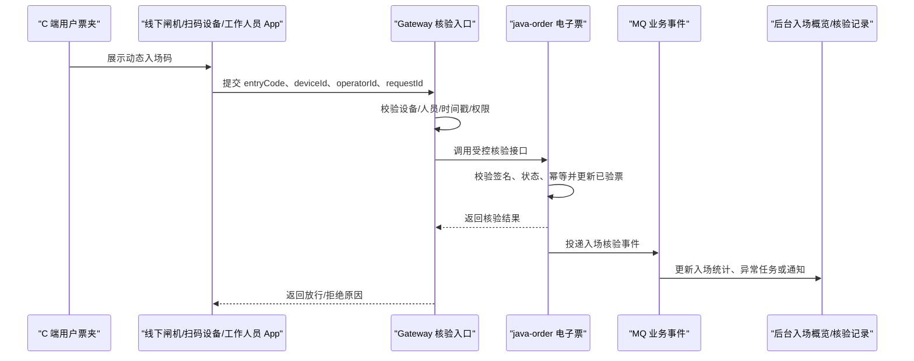

# 入场核验同步流程设计

> 阶段 0 输出物。本文只定义生产前方向，不直接修改业务代码或数据库。

## 结论

不建议把“B 端 Web 验票工作台”作为常规主流程。真实检票通常发生在线下，主流程应是闸机、手持扫码设备或工作人员 App 扫描 C 端票夹里的动态入场码，然后同步平台把电子票状态改为“已验票”。

平台侧需要补的是核验同步能力、核验记录、设备/人员权限、异常处理和备用人工入口。Web 工作台可以保留，但定位应是小型活动、设备故障、异常补录和后台复核的备用入口，不是所有主办方日常检票的默认入口。

## 现有能力

| 能力 | 当前证据 | 判断 |
|:---|:---|:---|
| C 端电子票 | `frontend/src/app/tickets/page.tsx` | 已展示票夹、入场码、已验票状态。 |
| 动态入场码 | `POST /api/order/tickets/{ticketId}/entry-code` | 已生成短期有效 HMAC 签名码。 |
| 内部核验接口 | `POST /api/order/internal/tickets/check-in` | 已校验 `X-Internal-Token` 并调用核验逻辑。 |
| 核验状态更新 | `TicketWalletService.checkIn(String entryCode)` | 已把未入场电子票改为已验票，并写 `checked_in_at`。 |
| 核验同步记录 | `POST /api/order/internal/tickets/check-in/sync`、`ticket_check_in_record` | 已记录成功、重复扫码、失败等核验请求，并支持 `requestId` 幂等。 |
| 主办方/平台入场概览 | `GET /api/ticket/admin/check-in/overview`、`GET /api/ticket/admin/check-in/records`、`frontend/src/app/console/check-in/page.tsx` | 已通过 `java-ticket` facade 查询 order-owned 核验记录，标准端口已验收。 |

第一阶段已经支撑“线下核验同步 + 核验记录查询 + 主办方入场概览”的只读闭环。真实大场馆线下检票仍缺 Gateway 设备/人员签名鉴权、限流、traceId、离线核验包和异常补录工作流。

## 推荐主流程

## 平台入口定位

| 入口 | 是否需要 | 定位 |
|:---|:---|:---|
| C 端票夹入场码 | 必须 | 用户展示动态码，已存在，后续打磨刷新、过期和失败态。 |
| 线下设备/工作人员 App 核验 API | 必须 | 真实主流程，负责扫描并同步平台。 |
| 主办方入场概览 | 建议 | 查看场次入场人数、未入场人数、异常核验、设备在线状态。 |
| 核验记录查询 | 必须 | 支撑客服、主办方、平台管理员追溯“是否已入场”。 |
| Web 扫码核验页 | 可选 | 小型活动、临时场地、设备故障时使用，必须受角色和场次权限限制。 |
| 异常补录入口 | 建议 | 只给授权运营或场务，用于线下已核验但同步失败的补录和复核。 |

因此，文档后续不要再写“先新增 B 端验票工作台”作为主任务，应改为“先设计入场核验同步流程和记录模型”，再决定是否做备用 Web 核验页。

## 权限边界

- 普通用户只能生成自己的入场码，不能调用核验写接口。
- 工作人员 App 或闸机不能直接暴露 `X-Internal-Token`，应走 Gateway 或核验接入层。
- 核验设备需要 `deviceId`、签名密钥、时间戳、nonce 或 requestId，防止重放。
- 工作人员需要绑定主办方、场次或场馆范围，不能跨主办方核验。
- 平台管理员可查全部核验记录；平台主办方运营员按职责范围查看和处理异常；主办方只看自己的活动/场次。

## 数据模型方向

第一阶段已补 order 库迁移：

- `ticket_check_in_record`：记录每次核验请求，包含 `ticket_id`、`order_id`、`user_id`、`session_id`、`device_id`、`operator_user_id`、`channel`、`request_id`、`result`、`failure_reason`、`checked_in_at`。
- `check_in_device`：记录设备身份、密钥摘要、绑定主办方/场次/场馆范围、状态和最近在线时间。
- `request_id` 建唯一索引，用于设备重试幂等。

后续增强重点不再是补记录表，而是把设备/人员鉴权前置到 Gateway 或核验接入层，并把异常补录、复核和设备在线状态做成可运营入口。

## 异常场景

| 场景 | 推荐处理 |
|:---|:---|
| 重复扫码 | 返回“已验票”和首次验票时间，不重复放行，记录重复扫描。 |
| 入场码过期 | 拒绝并提示用户刷新入场码。 |
| 已退款或已失效 | 拒绝入场，记录失败原因，必要时触发客服/现场处理。 |
| 已转赠原票 | 原票拒绝，受赠人新票可核验。 |
| 设备离线 | 大型场景可设计离线白名单或离线签名包；当前生产前可先要求在线核验。 |
| 同步失败 | 设备用 `requestId` 重试；后台提供异常补录和复核。 |

## 中间件使用

- Redis：设备频控、nonce 去重、短期核验结果缓存、设备在线状态。
- MQ：投递 `TICKET_CHECKED_IN`、`CHECK_IN_FAILED`、`CHECK_IN_DUPLICATED` 事件，用于统计、异常任务和通知。
- Seata：一般不需要介入单票核验；只有跨服务强一致的特殊场景再评估。
- Gateway：统一做设备/人员鉴权、限流、超时、traceId 和慢链路诊断。

## 种子数据要求

real-demo seed 第一阶段已补齐基础组合：

- 未入场、已验票、已失效、已转赠票据组合。
- 成功核验记录、重复扫码记录、停用设备失败记录。
- 至少一台有效设备和一台停用设备。
- 主办方入场概览和平台核验记录查询可用的 `sessionId=910011` 演示数据。

后续如果做异常补录和现场处理，还需要继续补过期码失败、退款后拒绝、工作人员权限和线下同步失败补录样本。

## 下一步

1. 继续补 Gateway 设备/工作人员鉴权、限流、traceId 和 requestId 防重放。
2. 设计异常补录与复核入口，只给授权运营或场务使用。
3. 评估备用 Web 扫码核验页，仅用于小型活动、设备故障或异常补录，不作为常规主流程。
4. 如接工作人员 App 或闸机，禁止暴露 `X-Internal-Token`，由 Gateway 或核验接入层换取内部调用。
